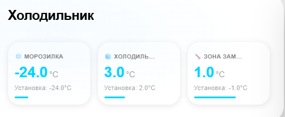
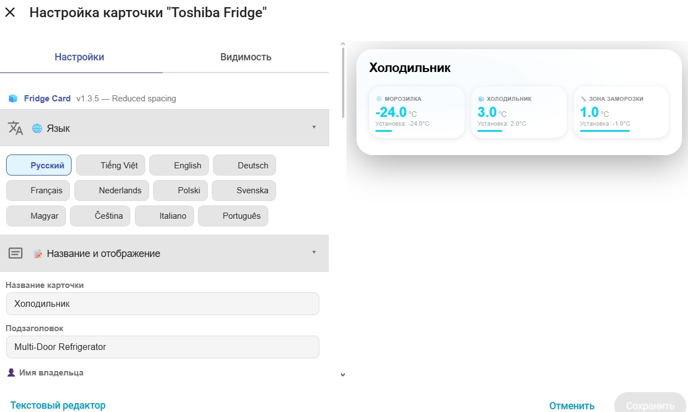

# HA Fridge Card

[](https://github.com/hacs/integration)


Пользовательская карточка для Home Assistant Lovelace, предназначенная для мониторинга и управления холодильником Toshiba GR-RF695WI-PGJ и аналогичными устройствами. Поддерживает отображение температуры в трёх зонах (морозильная камера, холодильная камера, Flex-зона), индикацию открытия дверей, визуальный редактор с настройкой цветов и фона, а также полностью настраиваемый интерфейс.

**Не требует дополнительных плагинов. Работает автономно, полностью настраивается через встроенный редактор UI.**

---

## 📸 Превью

<div style="display: flex; gap: 10px; flex-wrap: wrap;">
  
</div>

---

## 🎛️ Визуальный редактор



---

## ✨ Возможности

### 🎨 Отображение и интерфейс
- 🧊 **Основной экран** — название холодильника, подзаголовок, персонализированное приветствие
- 🌡️ **Три температурные зоны** — морозильная камера, холодильная камера, Flex-зона
- 📊 **Цветовая индикация температуры** — автоматическое изменение цвета в зависимости от значения
- 🚪 **Индикация открытых дверей** — визуальное выделение зоны с открытой дверью
- 📈 **Прогресс-бары** — визуальное отображение температуры в каждой зоне
- 🔄 **Актуальные настройки** — отображение установленной температуры для каждой зоны

### 🏠 Режимы работы
- **❄️ Четыре режима отображения**:
  - `flex` — три зоны (морозилка + холодильник + Flex)
  - `default` — две зоны (морозилка + холодильник)
  - `inverted` — две зоны в обратном порядке
  - `freezer` — только морозильная камера

### 🌙 Темы оформления
- **Default** — автоматическая (следует за системной темой HA)
- **Light** — светлая тема
- **Dark** — тёмная тема

### 🎨 Визуальная настройка
- **8 готовых градиентов фона** — Default, Night, Sunset, Forest, Aurora, Ocean, Ice, Deep Neon
- **6 цветовых настроек** — Температура морозилки, Температура холодильника, Температура Flex, Акцент, Текст, Открытая дверь
- **Настройка прозрачности фона** — от 0% до 100%
- **Настройка размытия фона** — от 0px до 30px

### 🖱️ Взаимодействие
- **📊 Клик по температуре** — открывает историю изменения температуры (more-info)
- **🚪 Клик по иконке двери** — открывает историю состояния двери

### 🌐 Поддержка языков (12 языков)
- 🇬🇧 English / 🇨🇿 Čeština / 🇩🇪 Deutsch / 🇫🇷 Français
- 🇮🇹 Italiano / 🇭🇺 Magyar / 🇳🇱 Nederlands / 🇵🇱 Polski
- 🇵🇹 Português / 🇷🇺 Русский / 🇸🇮 Slovenščina / 🇸🇪 Svenska

### 🔄 Дополнительные функции
- **📱 Адаптивная верстка** — корректное отображение на мобильных устройствах
- **⚡ Индикация статуса** — отображение текущего состояния системы (норма/открыта дверь)
- **🔋 Отображение мощности** — индикация потребляемой мощности (опционально)

---

## 📦 Установка

### Способ 1 — HACS (рекомендуется)

**Шаг 1:** Добавьте пользовательский репозиторий в HACS:

[](https://my.home-assistant.io/redirect/hacs_repository/?owner=ananyevgv&repository=ha-fridge-card&category=plugin)

> Если кнопка не работает, добавьте вручную:
> **HACS → Панель → ⋮ → Пользовательские репозитории**
> → URL: `https://github.com/ananyevgv/ha-fridge-card` → Тип: **Панель** → Добавить

**Шаг 2:** Найдите **HA Fridge Card** → **Установить**

**Шаг 3:** Жёстко обновите браузер (`Ctrl+Shift+R`)

---

### Способ 2 — Ручная установка

1. Скачайте [`ha-fridge-card.js`](https://github.com/ananyevgv/ha-fridge-card/releases/latest)
2. Скопируйте разархивированные файлы архива в `/config/www/ha-fridge-card`
3. Перейдите в **Настройки → Панели → Ресурсы** → **Добавить ресурс**:

| Параметр | Значение |
|----------|----------|
| URL | `/local/ha-fridge-card.js` |
| Тип ресурса | `JavaScript Module` |

---

## 🚀 Примеры использования

### Полная конфигурация (Flex-режим)
```yaml
type: custom:fridge-card
title: Холодильник
subtitle: Multi-Door Refrigerator
owner_name: Smart Home
language: ru
layout: flex
theme: default
temp_unit: C
freezer_entity: sensor.freezer_actual_temp
freezer_setting_entity: sensor.freezer_setting_temp
freezer_door_entity: binary_sensor.freezer_door
fridge_entity: sensor.refrigerator_actual_temp
fridge_setting_entity: sensor.refrigerator_setting_temp
fridge_door_entity: binary_sensor.refrigerator_door
flex_entity: sensor.flex_zone_actual_temp
flex_setting_entity: sensor.flex_zone_setting_temp
flex_door_entity: binary_sensor.flex_zone_door
mode_entity: sensor.variable_mode
